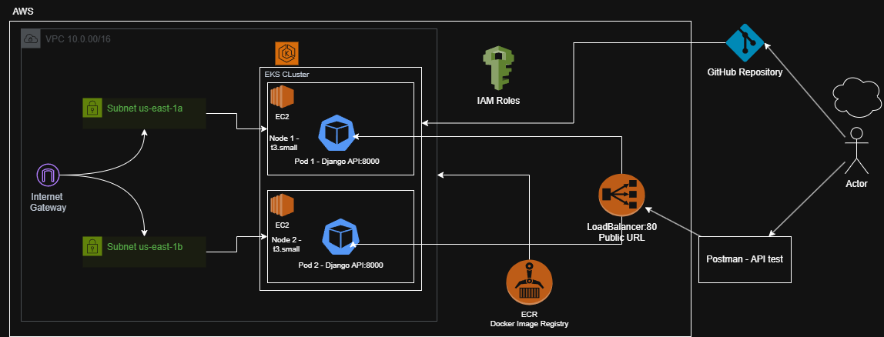

# Demo Devops Python

This is a simple application to be used in the technical test of DevOps.

## Getting Started

### Prerequisites

- Python 3.11.3

### Installation

Clone this repo.

```bash
git clone https://bitbucket.org/devsu/demo-devops-python.git
```

Install dependencies.

```bash
pip install -r requirements.txt
```

Migrate database

```bash
py manage.py makemigrations
py manage.py migrate
```

### Database

The database is generated as a file in the main path when the project is first run, and its name is `db.sqlite3`.

Consider giving access permissions to the file for proper functioning.

## Usage

To run tests you can use this command.

```bash
py manage.py test
```

To run locally the project you can use this command.

```bash
py manage.py runserver
```

Open http://localhost:8000/api/ with your browser to see the result.

### Features

These services can perform,

#### Create User

To create a user, the endpoint **/api/users/** must be consumed with the following parameters:

```bash
  Method: POST
```

```json
{
    "dni": "dni",
    "name": "name"
}
```

If the response is successful, the service will return an HTTP Status 200 and a message with the following structure:

```json
{
    "id": 1,
    "dni": "dni",
    "name": "name"
}
```

If the response is unsuccessful, we will receive status 400 and the following message:

```json
{
    "detail": "error"
}
```

#### Get Users

To get all users, the endpoint **/api/users** must be consumed with the following parameters:

```bash
  Method: GET
```

If the response is successful, the service will return an HTTP Status 200 and a message with the following structure:

```json
[
    {
        "id": 1,
        "dni": "dni",
        "name": "name"
    }
]
```

#### Get User

To get an user, the endpoint **/api/users/<id>** must be consumed with the following parameters:

```bash
  Method: GET
```

If the response is successful, the service will return an HTTP Status 200 and a message with the following structure:

```json
{
    "id": 1,
    "dni": "dni",
    "name": "name"
}
```

If the user id does not exist, we will receive status 404 and the following message:

```json
{
    "detail": "Not found."
}
```

## License

Copyright © 2023 Devsu. All rights reserved.

---

## DevOps Implementation

This section documents all the DevOps work done on top of the base application.

### Architecture

The following diagram shows how all the pieces connect — from a developer pushing code to the app running in AWS:



### Docker

The app is being Dockerized to make it portable and production-ready:

- **Base image:** `python:3.11-slim` — small and secure
- **Server:** Gunicorn with 2 workers instead of Django's built-in `runserver`
- **Security:** Runs as a non-root user (`appuser`)
- **Healthcheck:** Pings `/api/users/` every 30s to verify the app is alive
- **Startup:** Migrations run automatically before the server starts

**Build and run:**

docker build -t demo-devops-python .
docker run -p 8000:8000 -e DJANGO_SECRET_KEY="your-secret-key" -e DATABASE_NAME="db.sqlite3" demo-devops-python

### Kubernetes

The app runs in a dedicated namespace (`demo-devops`). 
We created a Deployment with 2 replicas, the app is always available, a LoadBalancer Service to expose it on port 80, and an HPA that scales up to 5 pods when CPU goes above 70%.

Configuration is separated from the code: non-sensitive values live in a ConfigMap and sensitive values in a Secret.

Each pod uses minimal resources — 50m to 200m CPU and 128Mi to 256Mi memory — since this is a lightweight API with SQLite.

**Deploy locally (minikube/Docker-Desktop):**

kubectl apply -f k8s/
kubectl get pods -n demo-devops
kubectl port-forward -n demo-devops service/demo-devops-service 8080:80

Then open http://localhost:8080/api/users/

### Infrastructure with Terraform (AWS)

I prefer Terraform to create the infrastructure in AWS. It provisions a VPC with 2 public subnets, EKS cluster with 2 worker nodes and an ECR repository to store the Docker image.

**Deploy the infrastructure:**

cd terraform
terraform init
terraform plan
terraform apply

After the apply, connect kubectl to the cluster:

aws eks update-kubeconfig --region us-east-1 --name demo-devops-cluster

**Destroy (important to evite high operation costs to te test):**

kubectl delete namespace demo-devops
terraform destroy

### CI/CD Pipeline

Every time we push to `main` or open a pull request to `main`, GitHub Actions runs the pipeline automatically.

Stage 1: checks code quality with `flake8` and runs the tests with `coverage` (96% covered). Stage 2: builds the Docker image, scans it for vulnerabilities with Trivy, and pushes it to Docker Hub. 
Stage 3: connects to AWS and deploys the app to the EKS cluster.

On pull requests to the main **only Stage 1** runs, we don't deploy code that hasn't been reviewed. 
Stages 2 and 3 only run when code is **merged to main**.

The pipeline needs 4 secrets configured in GitHub (Settings → Secrets → Actions): `DOCKER_USERNAME` and `DOCKER_PASSWORD` for Docker Hub, and `AWS_ACCESS_KEY_ID` and `AWS_SECRET_ACCESS_KEY` for AWS.

Pipeline execution results: https://github.com/mroscarwilches-debug/Devsu-demo-devops-python/actions/runs/27857802125

### Technical Decisions

**Gunicorn as production server.** Django's built-in `runserver` is meant for development only. 
Gunicorn handles multiple requests properly and is the standard for Django in production.
Gunicorn give us security, stability and optimized performance by supporting multiple concurrent processes
We pinned version 22.0.0 because Trivy flagged older versions with security vulnerabilities (HTTP Request Smuggling).

**2 Gunicorn workers instead of 3.** We started with 3 workers but the pods kept crashing with OOMKilled errors at 128Mi memory in test fase.
Dropping to 2 workers and bumping the limit to 256Mi solved the problem without overusing resources.

**SQLite as the database.** The original project came with SQLite and changing it was outside the scope of the exercise.

**Dedicated namespace for the app.** All Kubernetes resources live inside a `demo-devops` namespace. This keeps all organized, avoids conflicts with other apps in the cluster.

**LoadBalancer to expose the app.** A LoadBalancer give us a public URL that works from anywhere. This is what let us share the endpoint and test with Postman from the browser. Port-forward would work too but only locally.
This URL was delete when applied terraform destroy.

**Liveness and readiness probes.** Liveness checks if the app is alive every 30 seconds. If it fails 3 times, Kubernetes restarts the pod. 
Readiness checks if the app is ready to handle traffic. Until it passes, no requests are sent to that pod.

**Entrypoint script for migrations.** The `entrypoint.sh` runs `migrate --noinput` automatically before starting Gunicorn. This creates the database tables every time the container starts.

**Optimized .dockerignore.** Without excluding `terraform/` and `.github/`, Docker was copying 659MB of unnecessary files into the image. After fixing the `.dockerignore`, build context dropped to 2KB and build time went from 100 seconds to 2.6 seconds.

**Trivy for vulnerability scanning.** It scans OS packages and Python dependencies inside the image. 
We set it to report without blocking the build, since some vulnerabilities come from base image dependencies.

**Terraform over CloudFormation.** The difference is Terraform works with any cloud (AWS, GCP, Azure) while CloudFormation is AWS only.

**Terraform costs and the destroy workflow.** The workflow i followed: create the infrastructure, deploy the app, run the tests, take screenshots, and destroy everything to evite high costs.

**Terraform runs separately, not in the pipeline.** Infrastructure (VPC, EKS, ECR) is created once and stays running, there's no need to recreate it on every push.
If we putting `terraform apply` in the pipeline would add 15 minutes aprox. to every run, risk creating duplicate resources if the state file gets out of sync and expose infrastructure credentials to more steps than necessary. 
The pipeline only deploys the app to a cluster that already exists. 
**NOTE:** To make the full pipeline work (including the deploy step), run `terraform apply` manually first, then push to `main`, the pipeline will connect to the created previously cluster and deploy the app automatically.

**No NAT Gateway.** NAT Gateway is only needed for private subnets and adds unnecessary cost. Public subnets work fine for this test.

**Pipeline split into 3 jobs.** If the tests fail, there's no reason to build the image or deploy. 
Each job depends on the previous one, so a failure stops everything early. 
On pull requests, only the test job runs, we never deploy code that hasn't been reviewed.

**Development in stages.** We built the project step by step: first Docker, then Kubernetes, then Terraform, then CI/CD, however every step was follow with a previously test before to push. 
Each stage was committed separately so the git history shows a clear progression of the work.


**Postman for API testing.** Postman shows the request, response, status code, and headers in a single view. 
We used it to verify the API works both locally with Docker and in AWS through the LoadBalancer URL. 
**The screenshots serve as evidence that everything runs correctly.**

**Testing evidence.** All screenshots from the deployment, Postman tests, and pipeline results are saved in the `evidence/` folder. 
See `evidence/evidence.md` for a description of each file.

### Environment Variables

The app reads its configuration from environment variables. Locally they come from the `.env` file, in Docker they're passed with `-e`, and in Kubernetes they come from the ConfigMap and Secret.

`DJANGO_SECRET_KEY`: Key Django uses to sign sessions and tokens
`DATABASE_NAME`: Name of the SQLite database file
`DEBUG`: Turns debug mode on or off
`ALLOWED_HOSTS`: Which domains can access the app

A `.env.example` file is included as a reference. Copy it to `.env` and fill in your values.

### Project Structure

```
demo-devops-python/
├── .github/workflows/
│   └── ci-cd.yml              # CI/CD pipeline
├── api/                        # Django app (models, views, tests)
├── demo/                       # Django settings
├── evidence/                   # Screenshots and deployment evidence
│   └── evidence.md
├── k8s/                        # Kubernetes manifests
│   ├── namespace.yaml
│   ├── configmap.yaml
│   ├── secret.yaml
│   ├── deployment.yaml
│   ├── service.yaml
│   ├── ingress.yaml
│   └── hpa.yaml
├── terraform/                  # AWS infrastructure
│   ├── main.tf
│   ├── variables.tf
│   ├── outputs.tf
│   └── providers.tf
├── Dockerfile
├── entrypoint.sh
├── .dockerignore
├── .env.example
├── requirements.txt
└── manage.py
```
